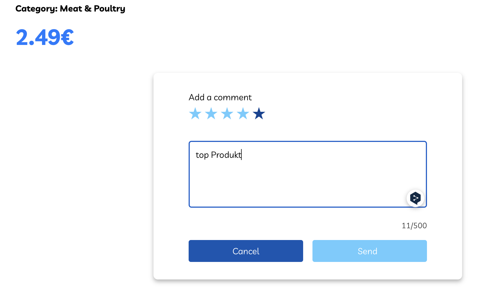
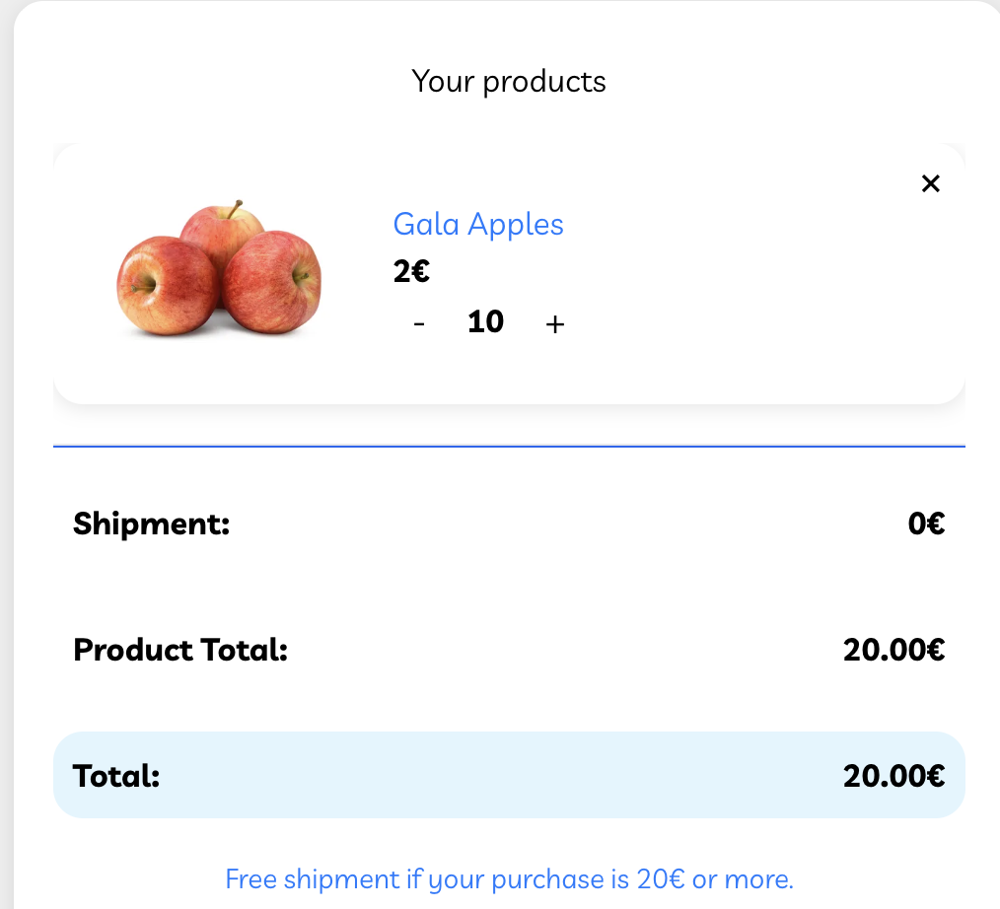
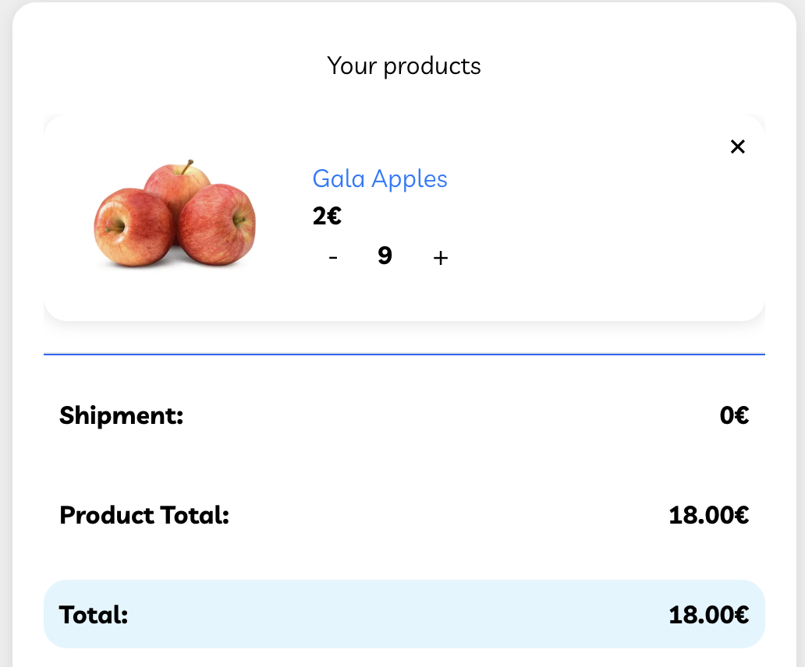

import screenshot

### TC_01 Bewertung eines gekauften Artiekels mit Kommentar
Umgebung: Eingelogt mit Username: mail@123.com Passwort: Test24 Produkt: Birchwood Quarter Pounders

Steps:
1. Produktseite von Birchwood Quarter Pounders öffnen.
2. Scrolle zum Bewertungsbereich.
3. Wähle 4 Sterne aus.
4. Trage Kommentar "Top Produkt" ein.
5. Klicke auf Send.

Erwartetes Resultat: Bewertung erscheint korrekt mit 4 Sternen und Kommentar.
Aktuelles Resultat: Bewertung erscheint mit 4 Sternen und Name aber ohne Kommentar.

----

### TC_02 Bewertung nachträglich anpassen
Umgebung: Eingelogt mit Username: mail@123.com Passwort: Test24 Produkt: Birchwood Quarter Pounders

Steps:
1. Produktseite von Birchwood Quarter Pounders öffnen.
2. Scrolle zum Bewertungsbereich.
3. Wähle die drei bearbeitungs Punkte aus und klicke auf "Edit"
4. Trage "Ideales Produkt" ein und ändere auf 5 Sterne
5. Klicke auf senden

Erwartetes Resultat: Bewertung erscheint korrekt mit 5 Sternen und Kommentar.
Aktuelles Resultat: Bewertung erscheint korrekt mit 5 Sternen und Kommentar.

----

### Tc_03 Bewertung Löschen
Umgebung: Eingelogt mit Username: mail@123.com Passwort: Test24 Produkt: Birchwood Quarter Pounders

Steps:
1. Produktseite von Birchwood Quarter Pounders öffnen.
2. Scrolle zum Bewertungsbereich.
3. Wähle die drei bearbeitungs Punkte aus und klicke auf "Delete"
4. in Pop up bestätigen

Erwartetes Resultat: Bewertung wird nicht mehr angezeigt 
Aktuelles Resultat: Bewertung wird nicht mehr angezeigt

----

### Tc_04 Altersfreigabe 18 Jahre
Umgebung: Eingelogt mit Username: mail@123.com Passwort: Test24 

Steps:
1. Shop Seite öffnen 
2. Datum in pop up eingegen 25-10-2007
3. Bestätigen

Erwartetes Resultat: Bestättigungs pop up und zugriff auf Alkoholische Produkte
Aktuelles Resultat: Bestättigungs pop up und zugriff auf Alkoholische Produkte

----

### Tc_05 Altersfreigabe 17 Jahre
Umgebung: Eingelogt mit Username: mail@123.com Passwort: Test24 

Steps:
1. Shop Seite öffnen 
2. Datum in pop up eingegen 25-10-2008
3. Bestätigen

Erwartetes Resultat: Abgelehnt pop up und kein zugriff auf Alkoholische Produkte
Aktuelles Resultat: Abgelehnt pop up und kein zugriff auf Alkoholische Produkte

----

### Tc_06 Alterseingabe über 18 fehlerhafte eingabe
Umgebung: Eingelogt mit Username: mail@123.com  Passwort Test24

Steps:
1. Shop Seite öffnen 
2. Datum in pop up eingegen 25.10.2008
3. Bestätigen

Erwartetes Resultat: Abgelehnt pop up und kein zugriff auf Alkoholische Produkte
Aktuelles Resultat: Abgelehnt pop up und kein zugriff auf Alkoholische Produkte

----

### tc_07 Versandkosten bei genau 20,00 €
Umgebung: Eingelogt mit Username: mail@123.com  Passwort Test24 Produkt: Gala Äpfel

Steps:
1. wähle 10 x Gala äpfel
2. Warenkorb hinzufügen
3. Warenkorb auswählen 
4. kosten auflistung überprüfen

Erwartetes Resultat: nur kosten der Ware ohne lieferkosten
Aktuelles Resultat: nur kosten der Ware ohne lieferkosten

----

### tc_08 Versandkosten bei genau 18,00 €
Umgebung: Eingelogt mit Username: mail@123.com  Passwort Test24 Produkt: Gala Äpfel

Steps:
1. wähle 9 x Gala äpfel
2. Warenkorb hinzufügen
3. Warenkorb auswählen 
4. kosten auflistung überprüfen

Erwartetes Resultat: kosten der Ware plus lieferkosten
Aktuelles Resultat: kosten der Ware plus lieferkosten

----

### tc_09 Versandkosten bei genau 20,00 € mit anschließender änderung auf 18,00 €
Umgebung: Eingelogt mit Username: mail@123.com  Passwort Test24 Produkt: Gala Äpfel

Steps:
1. wähle 10 x Gala äpfel
2. Warenkorb hinzufügen
3. Warenkorb auswählen 
4. Anzahl im Waren korb von 10 auf 9 ändern
5. kosten auflistung überprüfen

Erwartetes Resultat: kosten der Ware plus lieferkosten
Aktuelles Resultat: kosten der Ware ohne lieferkosten

